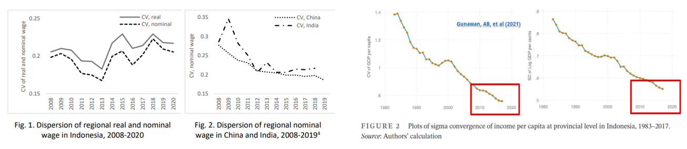
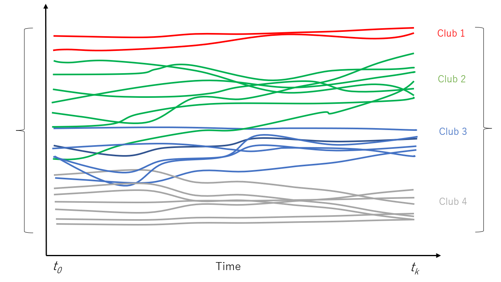
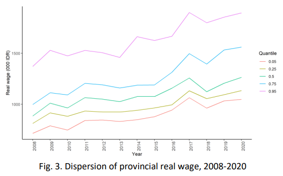
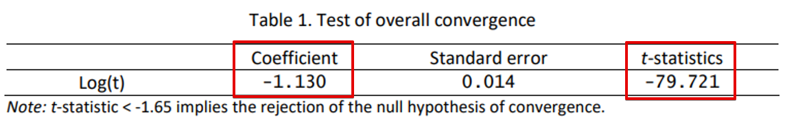
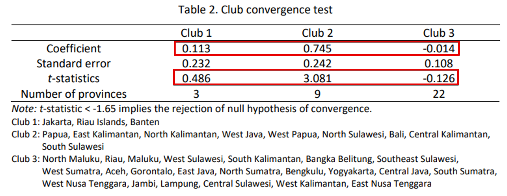
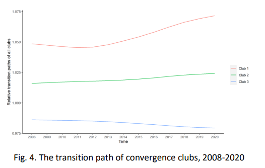
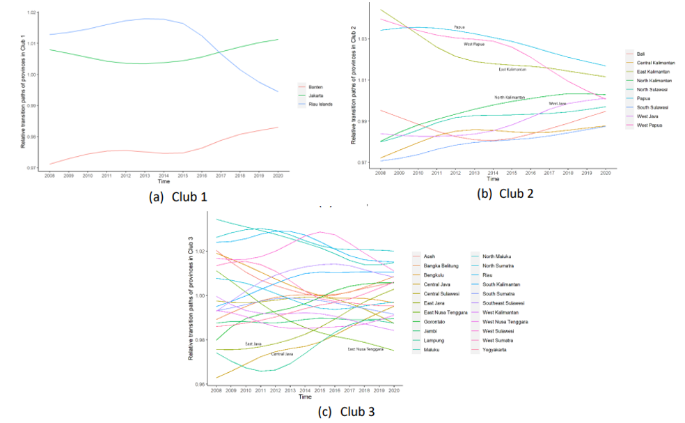
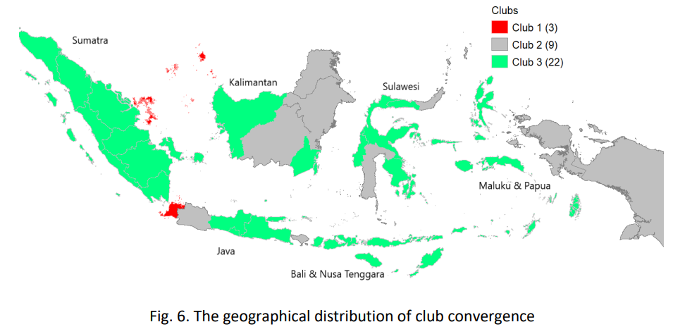
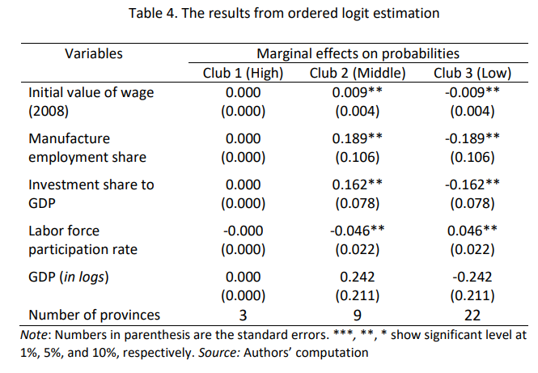

```{r setup, include=FALSE}
options(htmltools.dir.version = FALSE)
```

```{r xaringan-themer, include=FALSE, warning=FALSE}
library(xaringanthemer)
style_mono_light(
  background_color = "#FFF",
  text_font_family = xaringanthemer_font_default("text_font_family"),
  base_font_size = "18px",
   text_font_base = "sans-serif",
  header_font_google = google_font("Yanone Kaffeesatz")
)
library(knitr)
```


# Summary of the presentation

1. Backgrounds
  - Prolonged **regional income disparity** problems in Indonesia 
  - Persistent **disparity in regional wage** across Indonesian provinces, **despite improvement in regional connectivity**
--


2. Methods
  - Club convergence approach (Phillips & Sul, 2007,2009)
  - Ordered logit model
--


3. Data
  - Net real income per month received by a general worker (in thousand IDR)
--


4. Main results
  - **No overall convergence** in regional wage
  - Presence of **three club convergence**
  - Influencing factors of club convergence: initial level of wage, share of employment in manufacturing, investment share to GDP, and labor force participation rate
--
<br/><br/>
Computational notebook is available [***here***](https://deepnote.com/@harry-aginta/R-Club-convergence-of-regional-wage-across-Indonesian-provinces-in-R-ByLPKCPWQ-OuPjMPryU7aQ)

---
class: middle

### Introduction:
- Increasing trend of **disparity in regional wage** (income disparity declines) 
.center[]

--
  
### Objectives:
- To investigate regional wage convergence, **beyond average**.
- To study the underlying regions' charactertics influencing **club convergence**.

--

### Data:
- Net real income per month received by a general worker - not regional minimum wage
- Determinants of clubs: initial condition and various regional economic variables 
- Coverage: 34 provinces over 2008-2020 period
    

---
class: middle

## The methods:
- Club convergence (Phillips & Sul, 2007, 2009)

.center[]

- Ordered logit model (cross-section) <br/>
$$Y_{i}=\beta X_{i} + \epsilon_{i}$$
$Y_{i}$ is ordered category of club convergence (club=1,2,3...)  <br/>
$X_{i}$ set of explanatory variables

---
class: middle

## Stylized facts
- The distribution shows sign of club convergence

.center[]

---


class: middle

## The results
### No overall convergence; presence of club convergence

.center[]

--

.center[]

---
class: middle

## The results (con't...)
### Prolonged disparity between clubs...

.center[]

---
class: middle

## The results (con't...)
### ...smaller gaps within club

.center[]

---
class: middle

## The results (con't...)
### Spatial distribution of clubs

- No clear spatial pattern of **developed west vs lagging east** (as usually seen when studying income)
- Opposite spatial patterns between wage and income (further studies needed)

.center[]

---
class: middle

## The results (con't...)
### Influencing factors of club convergence

.center[]

---
class: middle
## Conclusions

- **Increasing trend** in regional **wage dispersion** in Indonesia

- **No overall convergence in regional wage**; instead **three club convergence** identified

- The **spatial distribution of wage** convergence clubs is different to that for regional **income** 

- Regional **labor market characteristics** influence the club convergence formation (e.g., initial level of wage, share of employment in manufacturing, investment share to GDP, and labor force participation rate)

--

## Limitations and further research avenues

- Investigate the significance of **spatial dependence** in two ways:
  - Spatial dependence in regional wage **dynamics**
  - Spatial dependence in **club convergence determinants**

- Calling for further investigations to study **the opposite spatial patterns between regional wage and income convergence**.

---

class: center, middle

# Thank you very much for your attention

<!--**https://haginta.github.io/Harry-Aginta/**-->

<!--Slides and working paper available at: <br/>
**https://haginta.github.io/IRSA-slides/IRSA_slides.html#1**-->


**Quantitative Regional and Computational Science lab**

**https://quarcs-lab.org/** <br/>


**https://haginta.github.io/Harry-Aginta/**


***


